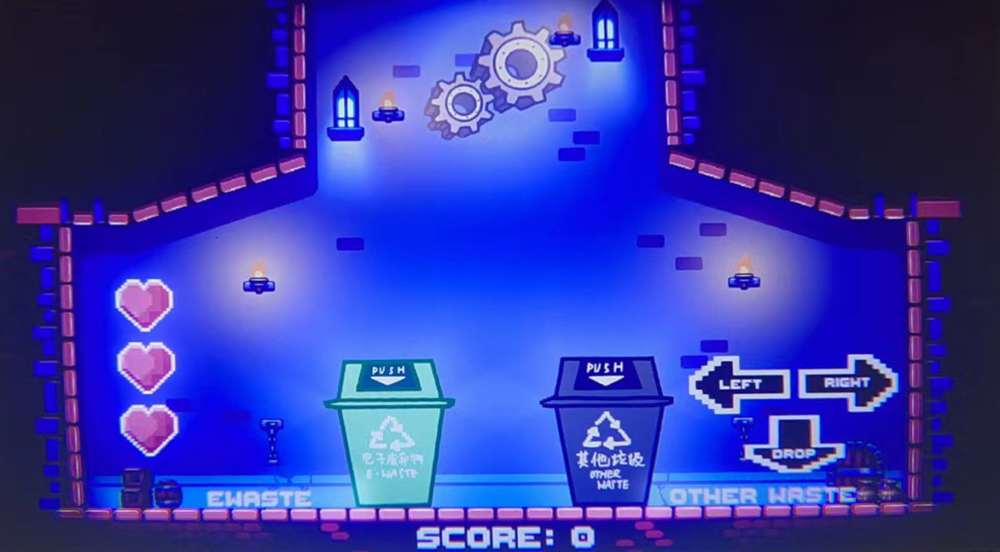
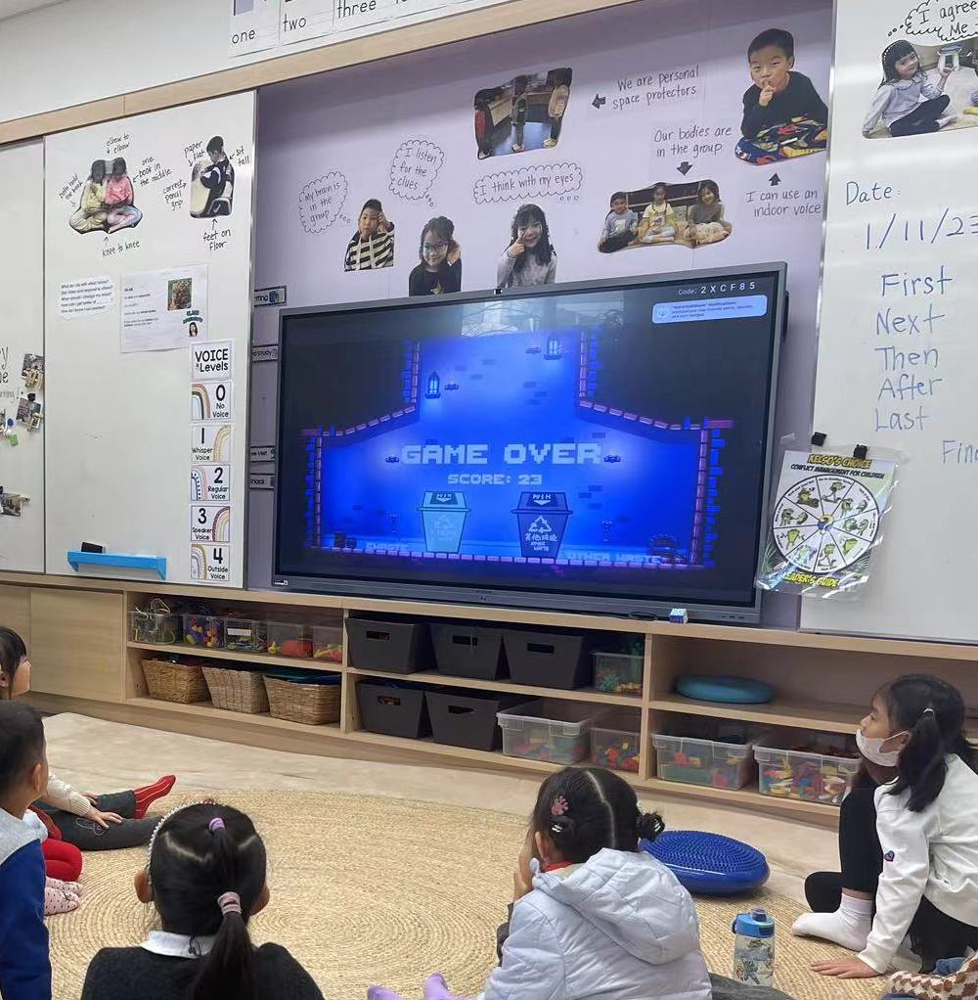

# Trash Sorting Game

| Game                                              | Game being played by ES                            |
| ------------------------------------------------- | -------------------------------------------------- |
|  |  |

We implemented the first e-waste curriculum and collection system in Shanghai's international schools, collecting 300+kg of e-waste and educating over 350 students and 50 teachers about the importance of proper e-waste treatment, in which this game played a part to teach the younger students in a more interactive way.
